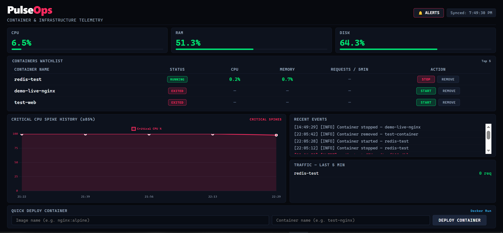

# PulseOps

PulseOps is a real-time monitoring dashboard for Linux servers and Docker containers. It tracks CPU, RAM and disk usage, detects container crashes, monitors HTTP traffic, stores alert history, and sends email notifications when a threshold is crossed. It runs as a self-hosted tool and does not depend on any third-party monitoring service.

- **Repository:** https://github.com/SyedaAyeshaRashidi/PulseOps
- **Live Dashboard:** http://13.60.249.241:5000
- **Deployment:** AWS EC2, automated with GitHub Actions
- **Uptime monitoring:** UptimeRobot

---

## Dashboard Preview



---

## Features

### Server Monitoring
- Live CPU, RAM and disk usage with color-coded bars (green, yellow, red)
- Updates every 10 seconds over WebSockets (Socket.IO), with a REST call for the initial load
- Dark UI that works on both desktop and mobile

### Docker Container Management
- Lists all running and exited containers using the Docker SDK
- Start, stop and remove containers from the dashboard
- **Volume safety check:** if a container has volumes or bind mounts attached, a warning is shown before removal to prevent accidental data loss
- Launch a new container by entering an image name
- **409 conflict handling:** if a container with the same name already exists (exited), it is restarted instead of returning an error

### Alerting
- **System alerts:** CPU ≥ 85%, RAM ≥ 80%, Disk ≥ 90%, sustained over 3 consecutive checks to avoid false positives
- **Container alerts:** CPU spikes, memory warning (80%), memory critical (90%) and unexpected crashes
- Distinguishes between a container stopped from the UI and one that actually crashed. Only genuine crashes trigger an alert
- Email notifications over SMTP using a Gmail App Password

### Traffic Monitoring
- Parses container access logs and counts HTTP requests from the last 5 minutes
- Per-container request count is shown in the dashboard table and the traffic widget

### Persistent History
- SQLite stores past alerts and critical metric spikes, so data survives app restarts
- Dedicated Alert History page
- Chart.js graph of critical CPU spikes. Only anomalies are plotted, not idle baseline data

### CI/CD
- GitHub Actions pipeline automates deployment on every push to `main`
- No manual copying of files to the server when shipping updates

### Self Monitoring
- The dashboard itself is monitored externally with UptimeRobot, so downtime of the app or the instance triggers a notification

---

## Tech Stack

| Layer | Technology |
|---|---|
| Backend | Python, Flask, Flask-SocketIO, Flask-SQLAlchemy |
| Container API | Docker SDK for Python |
| Host metrics | psutil |
| Database | SQLite |
| Real-time | Socket.IO (WebSockets) |
| Frontend | HTML, vanilla JS, CSS Grid / Flexbox, Chart.js |
| Email alerts | Python `smtplib` (SMTP over TLS) |
| Hosting | AWS EC2 (Ubuntu 24.04), systemd, Docker |
| CI/CD | GitHub Actions |
| Uptime check | UptimeRobot |

---

## Project Structure

```text
PulseOps/
├── .github/
│   └── workflows/          # GitHub Actions CI/CD pipeline
├── app.py                  # Flask app, routes, alert logic, background thread
├── collector.py            # Host CPU/RAM/Disk metrics via psutil
├── docker_health.py        # Container stats via Docker SDK
├── traffic_monitor.py      # HTTP request count from container logs
├── alerts.py               # Email alerts (SMTP)
├── database.py             # SQLAlchemy models (MetricHistory, AlertHistory)
├── main.py                 # Terminal dashboard (standalone mode)
├── templates/
│   ├── dashboard.html      # Main dashboard (dark UI, Socket.IO, Chart.js)
│   └── alerts.html         # Alert history page
├── Dockerfile
├── docker-compose.yml
└── requirements.txt
```

---

## Getting Started

### Prerequisites
- Docker and Docker Compose
- Python 3.10+
- A Gmail account with an App Password (for email alerts)

### Run with Docker Compose

```bash
git clone https://github.com/SyedaAyeshaRashidi/PulseOps.git
cd PulseOps

export GMAIL_ADDRESS="your@gmail.com"
export GMAIL_APP_PASSWORD="your_app_password"

docker compose up -d
```

Then open http://localhost:5000 in your browser.

### Run Locally (without Docker)

```bash
git clone https://github.com/SyedaAyeshaRashidi/PulseOps.git
cd PulseOps

python3 -m venv venv
source venv/bin/activate
pip install -r requirements.txt

export GMAIL_ADDRESS="your@gmail.com"
export GMAIL_APP_PASSWORD="your_app_password"

python3 app.py
```

---

## Alert Conditions

| Condition | Threshold | Behavior |
|---|---|---|
| System CPU | ≥ 85% for 30s | Email alert |
| System RAM | ≥ 80% for 30s | Email alert |
| System Disk | ≥ 90% for 30s | Email alert |
| Container CPU | ≥ 85% | Immediate email alert |
| Container memory (warning) | ≥ 80% | Email alert |
| Container memory (critical) | ≥ 90% | Urgent email alert |
| Container crash | Unexpected exit | Immediate email alert |
| Manual stop | Stopped from the UI | No alert |

---

## Deployment

PulseOps runs on an AWS EC2 instance (Ubuntu 24.04). The app is managed by systemd, so it runs in the background and restarts automatically after a reboot or a failure.

### Systemd Service

```ini
# /etc/systemd/system/pulseops.service
[Unit]
Description=PulseOps Dashboard
After=network.target docker.service
Requires=docker.service

[Service]
User=ubuntu
WorkingDirectory=/home/ubuntu/PulseOps
EnvironmentFile=/etc/pulseops.env
ExecStart=/home/ubuntu/PulseOps/venv/bin/python app.py
Restart=always
RestartSec=5

[Install]
WantedBy=multi-user.target
```

Gmail credentials are kept in `/etc/pulseops.env` and are never committed to the repository:

```text
GMAIL_ADDRESS=your@gmail.com
GMAIL_APP_PASSWORD=your_app_password
```

Enable and start the service:

```bash
sudo systemctl daemon-reload
sudo systemctl enable --now pulseops
```

The service user needs access to the Docker socket, otherwise container stats will not load.

### CI/CD with GitHub Actions

Deployment is automated with a GitHub Actions workflow located in `.github/workflows/`. Whenever changes are pushed to `main`, the workflow runs and updates the application on the EC2 instance. Sensitive values such as SSH keys and server details are stored in GitHub repository secrets, not in the code.

### Uptime Monitoring

UptimeRobot checks the dashboard at regular intervals and sends a notification if the app or the server becomes unreachable.

---

## Why I Built This

Tools like Grafana, Datadog and Prometheus are powerful, but they need a lot of setup and usually extra agents. I wanted to understand how monitoring works underneath: collecting server metrics, talking to the Docker API, streaming data to the browser in real time, and building an alerting pipeline. So I built PulseOps from scratch.
